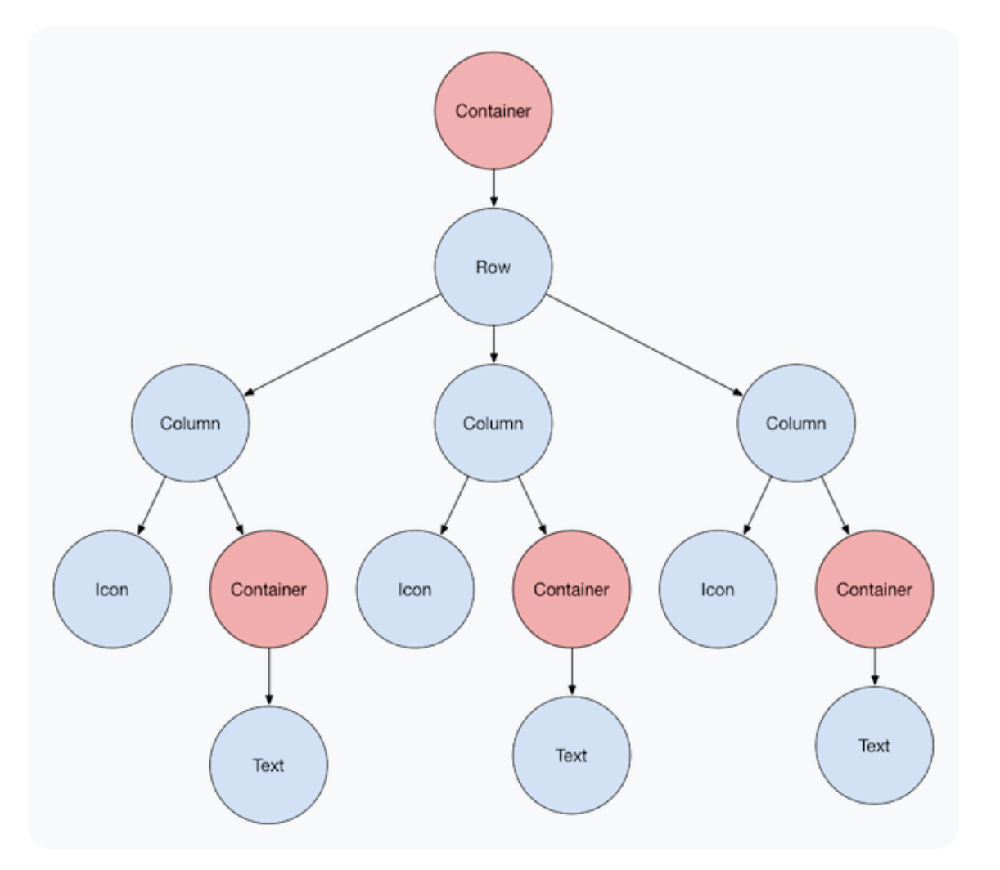
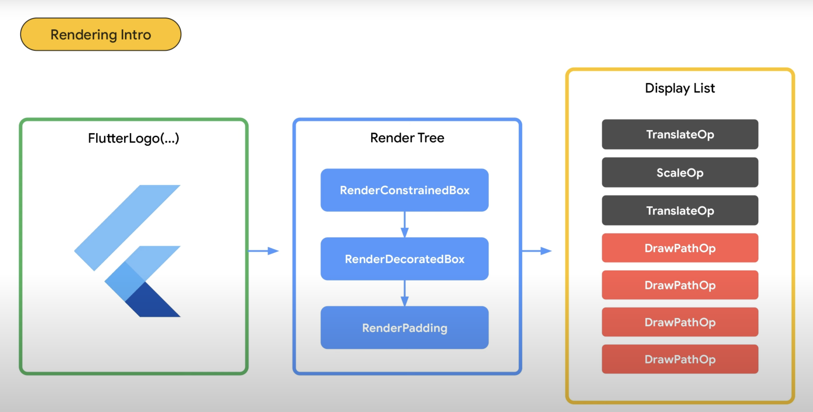
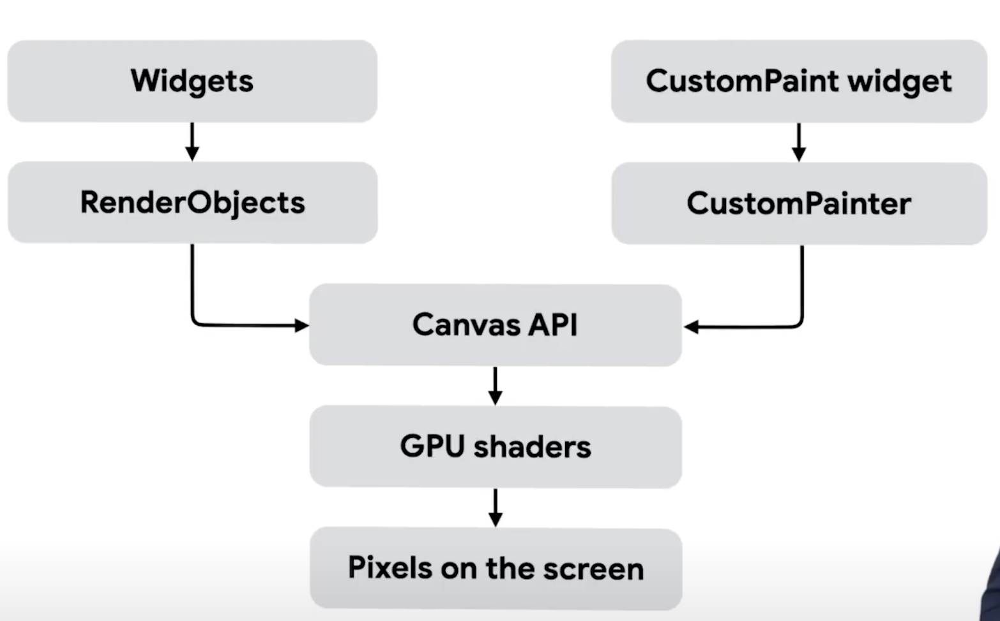
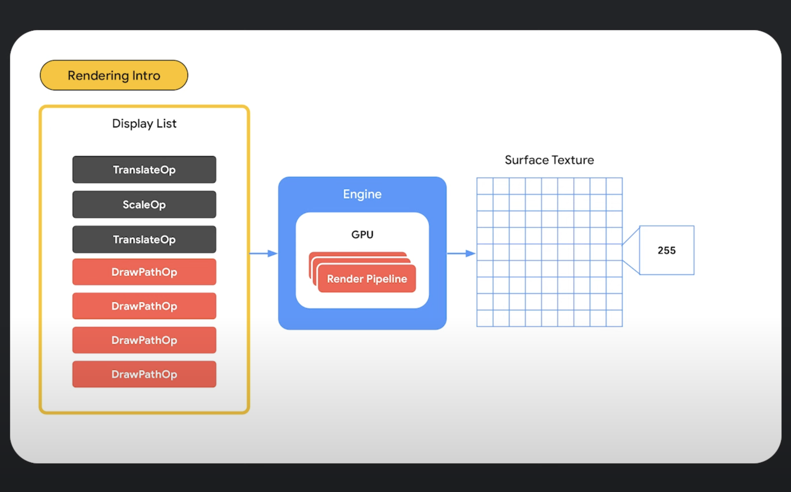

# Flutter Rendering 🎯🎯🎯

## Tổng quan - Câu chuyện đơn giản

Hãy tưởng tượng bạn muốn vẽ một bức tranh:
1. **Bước 1**: Bạn viết mô tả "Tôi muốn vẽ gì" (Widget Tree)
2. **Bước 2**: Bạn tính toán "Vẽ ở đâu, kích thước bao nhiêu" (Render Tree)
3. **Bước 3**: Bạn tạo danh sách "Các bước vẽ cụ thể" (Display List)
4. **Bước 4**: Máy tính thực hiện vẽ thành pixel (Engine + GPU)
5. **Bước 5**: Hiển thị lên màn hình (Surface Texture)

---

## 📱 BƯỚC 1: Widget Tree - "Tôi muốn vẽ gì?"



### Code Dart
```dart
Container(                   
  child: Row(                
    children: [
      Column(             
        children: [
          Icon(Icons.home),
          Container(
            child: Text('Home')
          )
        ]
      ),
      Column(
        children: [
          Icon(Icons.search),
          Container(
            child: Text('Search')
          )
        ]
      ),
      Column(  
        children: [
          Icon(Icons.profile),
          Container(
            child: Text('Profile')
          )
        ]
      )
    ]
  )
)
```

### Widget Tree như một "bản thiết kế"
```
         Container (hộp chính)
              ↓
           Row (hàng ngang)
              ↓
    ┌─────────┼─────────┐
    ↓         ↓         ↓
 Column    Column    Column
    ↓         ↓         ↓
 Icon+Text Icon+Text Icon+Text
```

### Đặc điểm: 
- Chỉ là **mô tả**, chưa có kích thước hay vị trí cụ thể
- Như viết "Tôi muốn 1 cái bàn, 3 cái ghế" nhưng chưa biết đặt ở đâu

---

## 🏗️ BƯỚC 2: Render Tree - "Vẽ ở đâu, kích thước bao nhiêu?"



### Flutter chuyển Widget thành RenderObject

### Quá trình tính toán:

#### Phase 1: Layout (Tính kích thước & vị trí)
```dart
// RenderObject tính toán:
RenderConstrainedBox.performLayout() {
  // 1. "Tôi có bao nhiêu không gian?" 
  constraints = BoxConstraints(maxWidth: 375, maxHeight: 812); // iPhone size
  
  // 2. "Con tôi cần bao nhiêu không gian?"
  child.layout(constraints);
  
  // 3. "Tôi sẽ có kích thước này"
  size = Size(375, 100); // Container cuối cùng 375x100
  
  // 4. "Đặt con ở vị trí này"
  child.parentData.offset = Offset(0, 0);
}

RenderRow.performLayout() {
  // Chia đều cho 3 columns
  columnWidth = 375 / 3 = 125;
  
  // Đặt vị trí từng column
  column1.offset = Offset(0, 0);     // Cột 1: x=0
  column2.offset = Offset(125, 0);   // Cột 2: x=125  
  column3.offset = Offset(250, 0);   // Cột 3: x=250
}
```

#### Phase 2: Paint (Tạo lệnh vẽ)
```dart
RenderDecoratedBox.paint(canvas, offset) {
  // Vẽ background container
  canvas.drawRect(
    Rect.fromLTWH(0, 0, 375, 100),
    Paint()..color = Colors.grey
  );
  
  // Vẽ children
  paintChild(column1, Offset(0, 0));
  paintChild(column2, Offset(125, 0));
  paintChild(column3, Offset(250, 0));
}

RenderIcon.paint(canvas, offset) {
  // Vẽ icon
  canvas.drawPath(iconPath, Paint()..color = Colors.blue);
}

RenderText.paint(canvas, offset) {
  // Vẽ text
  textPainter.paint(canvas, offset);
}
```

**Kết quả**: Bây giờ đã biết chính xác "vẽ cái gì, ở đâu, kích thước bao nhiêu"

---

#### Canvas API




- Canvas trong Flutter là abstraction layer giữa high-level Flutter code và low-level GPU rendering. Nó cung cấp một API để "vẽ" lên một surface 2D.

- Nếu như mọi người thường hay nói mọi con đường đều dẫn tới thành Romes thì trong Flutter mọi con đường đều dẫn tới Canvas API :D

~~~dart
abstract class Canvas {
  // Drawing primitives
  void drawRect(Rect rect, Paint paint);
  void drawCircle(Offset center, double radius, Paint paint);
  void drawPath(Path path, Paint paint);
  void drawLine(Offset p1, Offset p2, Paint paint);
  
  // Advanced drawing
  void drawImage(Image image, Offset offset, Paint paint);
  void drawParagraph(Paragraph paragraph, Offset offset);
  void drawVertices(Vertices vertices, BlendMode blendMode, Paint paint);
  
  // Transformations
  void translate(double dx, double dy);
  void scale(double sx, [double? sy]);
  void rotate(double radians);
  void skew(double sx, double sy);
  void transform(Float64List matrix4);
  
  // State management
  void save();
  void restore();
  void saveLayer(Rect? bounds, Paint paint);
  
  // Clipping
  void clipRect(Rect rect);
  void clipPath(Path path);
  void clipRRect(RRect rrect);
}
~~~


## 📋 BƯỚC 3: Display List - "Danh sách các bước vẽ"

### Từ Paint operations → Display List:
```dart
// Tất cả lệnh paint() được gom lại thành Display List:
DisplayList = [
  TranslateOp(x: 0, y: 0),           // "Di chuyển bút vẽ đến (0,0)"
  ScaleOp(scale: 1.0),               // "Không scale gì"
  TranslateOp(x: 0, y: 0),           // "Vẫn ở (0,0)"
  
  DrawPathOp(                        // "Vẽ background container"
    path: containerRect,
    paint: greyPaint
  ),
  
  DrawPathOp(                        // "Vẽ icon 1"
    path: homeIconPath, 
    paint: bluePaint
  ),
  
  DrawPathOp(                        // "Vẽ text 'Home'"
    path: homeTextPath,
    paint: textPaint  
  ),
  
  DrawPathOp(                        // "Vẽ icon 2"
    path: searchIconPath,
    paint: bluePaint
  ),
  
  DrawPathOp(                        // "Vẽ text 'Search'"
    path: searchTextPath, 
    paint: textPaint
  ),
  
  DrawPathOp(                        // "Vẽ icon 3"
    path: profileIconPath,
    paint: bluePaint
  ),
  
  DrawPathOp(                        // "Vẽ text 'Profile'"
    path: profileTextPath,
    paint: textPaint
  )
]
```

## 🖥️ BƯỚC 4: Engine + GPU - "Máy tính thực hiện vẽ"




### Engine nhận Display List:
```cpp
// Flutter Engine (C++) nhận Display List
void Engine::processDisplayList(DisplayList& list) {
  // 1. Tối ưu hóa
  optimizeCommands(list); // Gộp các lệnh giống nhau
  
  // 2. Gom nhóm
  auto batches = batchSimilarOperations(list);
  
  // 3. Gửi xuống GPU
  for (auto batch : batches) {
    gpu->executeCommands(batch);
  }
}
```

### GPU xử lý:
```glsl
// GPU Shader xử lý từng pixel
// Với screen 375x100 = 37,500 pixels

void main() {
  vec2 pixelPosition = gl_FragCoord.xy; // Vị trí pixel hiện tại
  
  // Kiểm tra pixel này thuộc element nào
  if (pixelInContainer(pixelPosition)) {
    gl_FragColor = vec4(0.5, 0.5, 0.5, 1.0); // Màu xám container
  }
  else if (pixelInHomeIcon(pixelPosition)) {
    gl_FragColor = vec4(0.0, 0.0, 1.0, 1.0); // Màu xanh icon
  }
  else if (pixelInHomeText(pixelPosition)) {
    gl_FragColor = vec4(0.0, 0.0, 0.0, 1.0); // Màu đen text
  }
  // ... tương tự cho các elements khác
}
```

**Điều kỳ diệu**: GPU xử lý **tất cả 37,500 pixels CÙNG LÚC** thay vì từng pixel một!

---

## 🖼️ BƯỚC 5: Surface Texture - "Kết quả cuối cùng"

### Pixel Buffer được tạo:
```
Surface Texture (375x100 pixels)
┌─────┬─────┬─────┬─────┬─────┬─────┬─────┬─────┬─────┐
│R128 │R128 │R128 │R128 │R128 │R128 │R128 │R128 │R128 │ ← Container background
│G128 │G128 │G128 │G128 │G128 │G128 │G128 │G128 │G128 │
│B128 │B128 │B128 │B128 │B128 │B128 │B128 │B128 │B128 │
│A255 │A255 │A255 │A255 │A255 │A255 │A255 │A255 │A255 │
├─────┼─────┼─────┼─────┼─────┼─────┼─────┼─────┼─────┤
│R0   │R0   │R255 │R255 │R128 │R128 │R0   │R0   │R255 │ ← Icons + Text
│G0   │G0   │G0   │G0   │G128 │G128 │G0   │G0   │G0   │
│B255 │B255 │B0   │B0   │B128 │B128 │B255 │B255 │B0   │
│A255 │A255 │A255 │A255 │A255 │A255 │A255 │A255 │A255 │
└─────┴─────┴─────┴─────┴─────┴─────┴─────┴─────┴─────┘
   ↑      ↑      ↑      ↑      ↑      ↑      ↑      ↑
 Icon1  Icon1  Text1  Text1  Space  Space  Icon2  Text2
```

### Memory Usage:
```dart
// Tính toán memory
int width = 375;
int height = 100; 
int bytesPerPixel = 4; // RGBA

int totalMemory = width * height * bytesPerPixel;
// = 375 * 100 * 4 = 150,000 bytes = 150KB cho frame này
```

**Kết quả**: Một ma trận pixel với màu sắc cụ thể, sẵn sàng hiển thị!
